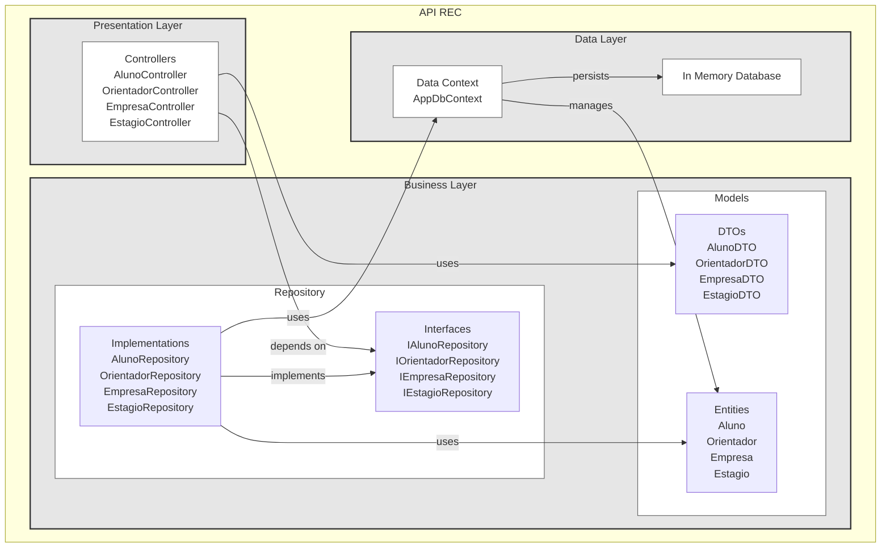
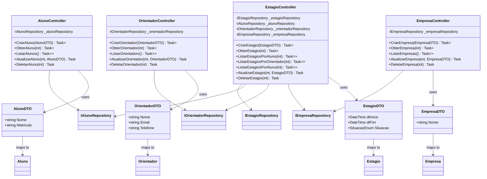
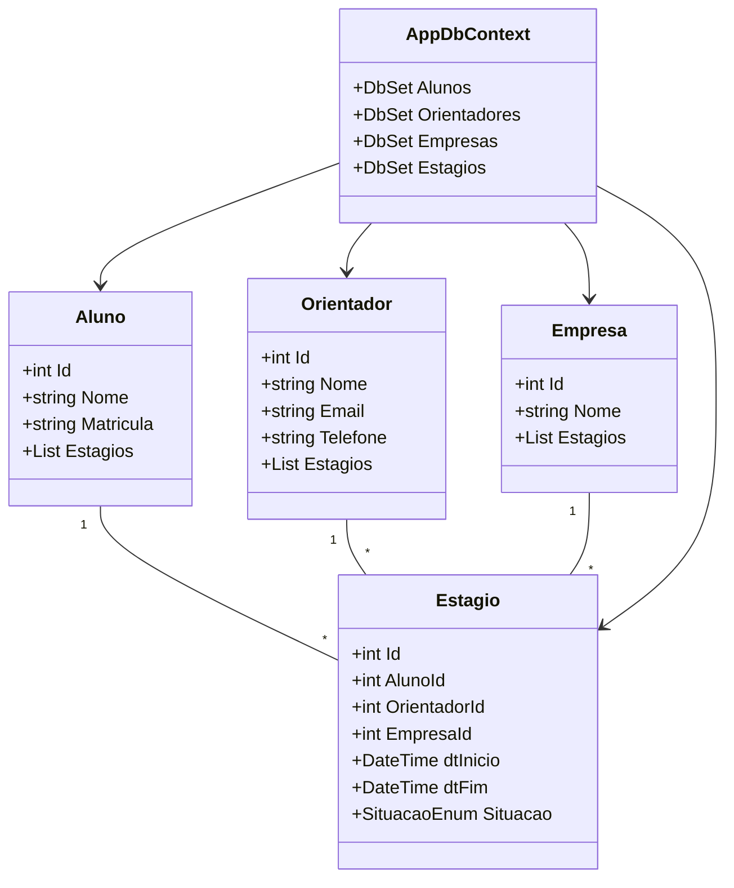
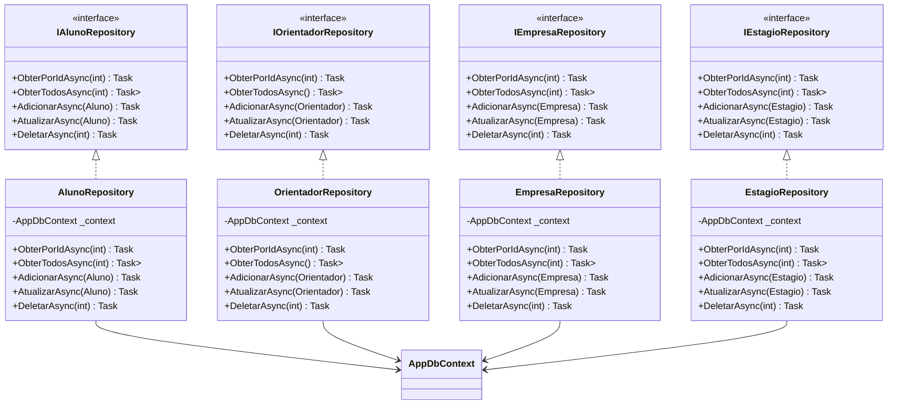

# Trabalho de Projeto de Sistemas
##### Equipe: Caio Lessa, Marcos dos Santos, Matheus S. Caldas, Thiago Borges

## Diagrama de Pacotes da Arquitetura MVC

## Diagrama de Classes por Camada

### Controller e DTO Layer

### Model Layer

### Repository Layer

